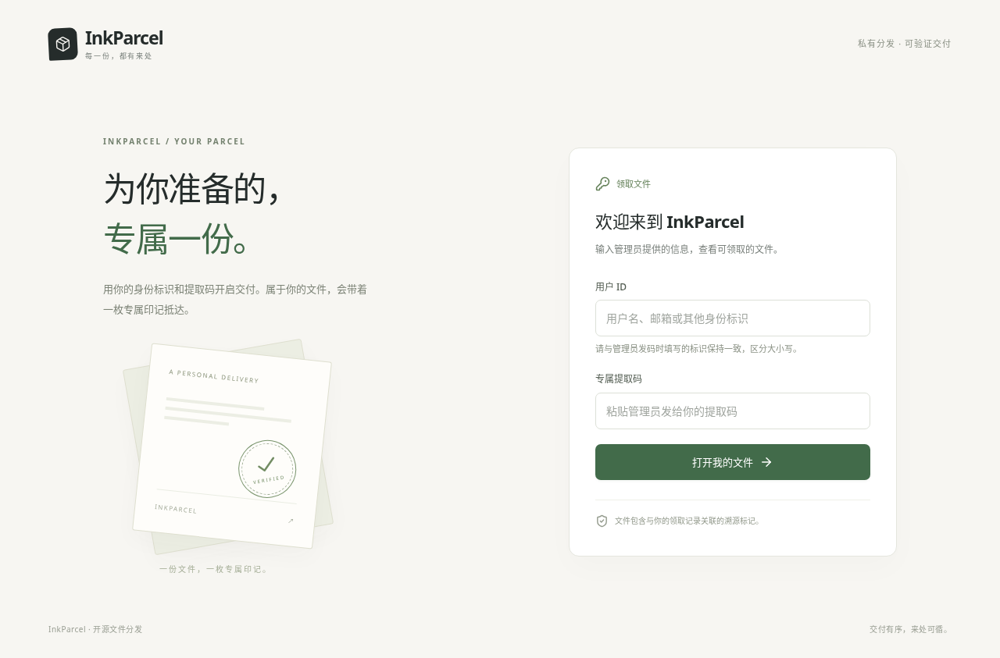

# InkParcel

简体中文 | [English](docs/en/README.md)

**自托管文件分发，为每次领取写入可验证的专属标记。**

给每位领取者发放专属提取码，用文件夹整理私有文件，指定哪些分发密钥可见，再提供带有个人标记的下载副本。需要溯源时，在浏览器本地读取文件标记，查询对应的领取者与文件版本；待溯源文件本身不会上传。

InkParcel 运行于 Cloudflare Workers、R2 和 D1。首个文件处理器支持 Android APK，通过 APK 签名块中的自定义条目写入标记，无需发布者的签名私钥，也无需重新签名。网页和默认文档均为中文。



## 功能

- 根据自定义用户 ID 和带名称的分发密钥生成专属提取码。
- 首次验证自动登记用户，支持备注、封禁用户和停用密钥。
- 多层文件夹与明确的多密钥文件可见性；未选择密钥时仅管理员可见，移动文件不改变权限。
- 可续传的分片上传，以及通过私有存储提供的个性化流式下载。
- 同一次签发的文件字节保持稳定，支持 HTTP 断点续传，已上传版本不可覆盖。
- 浏览器本地提取标记，增量计算并验证内容指纹。
- 受一次性令牌保护的初始化、自定义管理路径与密码认证。
- 统一的文件格式注册机制，涵盖标记写入、提取、指纹和预检。

完整且验证通过的标记对应一条**签发记录**。标记可以被移除或复制，因此不能单独证明是谁泄露了文件。详见[安全边界](SECURITY.md)与[支持的 APK 布局](docs/apk-format.md)。

## 本地运行

需要 Node.js 22.12 或更新版本，以及 pnpm 9.15.9。在仓库根目录执行：

```sh
pnpm install --frozen-lockfile
pnpm setup:local
pnpm db:migrate
pnpm dev
```

打开 Wrangler 输出的本地地址，访问 `/admin`。使用 `.dev.vars` 中生成的 `BOOTSTRAP_TOKEN`，设置强密码并保存新的管理路径；旧 `/admin` 随后失效。本地凭据和存储已被 Git 忽略，与 Cloudflare 资源相互独立。

在不可变 SteamOS 工作站上，请进入 `distrobox enter dev` 后执行开发命令；其他开发环境可直接运行。

## 部署

按照[部署指南](docs/deployment.md)创建私有 R2 存储桶和 D1 数据库，配置密钥、执行迁移并部署 Worker。

小规模部署可以利用 Cloudflare 的免费额度，但这不是无限免费的保证：R2 需要开通订阅，超额用量可能计费，Workers Free 每次调用的 CPU 预算为 10 ms。在确认适用免费套餐前，需要使用有代表性的文件进行实际线上测量。

## 文档与开发

| 文档                           | 内容                                |
| ------------------------------ | ----------------------------------- |
| [产品规格](docs/SPEC.md)       | 功能行为、范围与验收条件            |
| [API 契约](docs/API.md)        | HTTP 接口与共享模块契约             |
| [APK 格式](docs/apk-format.md) | 二进制布局、支持的签名与规范化指纹  |
| [部署指南](docs/deployment.md) | 本地运行、Cloudflare 部署与费用边界 |
| [运维指南](docs/operations.md) | 后台管理、备份、恢复与升级          |
| [验证记录](docs/validation.md) | 实际测试证据与尚未验证的部署边界    |
| [参与贡献](CONTRIBUTING.md)    | 开发与变更验证流程                  |

`pnpm check` 执行格式、类型、包测试和生产部署预演。`pnpm fixtures && pnpm test:apk` 生成通用 APK，并使用 Android SDK 验证签名保留情况。`pnpm test:e2e` 通过 Chromium 测试真实的本地 Worker；环境要求见[参与贡献](CONTRIBUTING.md)。

## 许可证

采用 [Apache-2.0](LICENSE) 许可证。私下报告安全漏洞的方法见[安全政策](SECURITY.md)。
